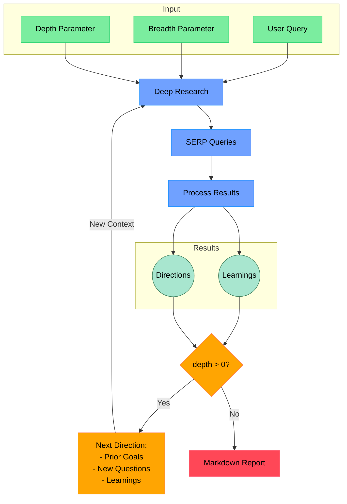

# Shandu Deep Research System

An AI-driven research system that performs comprehensive, iterative research on any topic using multiple search engines and LLMs to generate detailed, long-form reports.

[](LICENSE)
[](https://www.python.org/downloads/)

## Algorithm


Credits: This project was inspired by [deep-research](https://github.com/dzhng/deep-research/) but implements a custom scraper and optimized workflow.

## Key Features

- **Iterative Research**: Recursively explores topics through multiple search engines with thematic organization
- **Ethical Web Scraping**: Respects robots.txt rules and implements caching to minimize server impact
- **Comprehensive Reports**: Generates 7000+ word detailed, well-structured markdown research reports
- **Configurable Parameters**: Fine-tune research depth and breadth to suit your specific needs
- **Source Evaluation**: Automatically assesses reliability and credibility of information sources
- **Parallel Processing**: Optimized with concurrent operations for more efficient execution
- **Lightweight Search**: Quick AI-powered search alternative with the `aisearch` command

## Installation

```bash
pip install shandu
```

```bash
# Install from source
git clone https://github.com/jolovicdev/shandu.git
cd shandu
pip install -e .
```

## Quick Start

```bash
# Configure API settings, for development I used studio nebius
shandu configure

# Run research
shandu research "Your research query" --depth 2 --breadth 4 --output report.md

# Quick AI-powered search (should work with most models, no matter of pretraining)
shandu aisearch "Who is current sitting president of United States?" --detailed
Search Results: Who is current sitting president of United States?
The current sitting president of the United States is Donald J. Trump, who serves as the 47th President of the United States. He began his second term in office on January 20, 2025.
Model used: meta-llama/Meta-Llama-3.1-405B-Instruct

# Basic search
shandu search "Your search query"
```

## Usage

### Research Command

```bash
shandu research "Your research query" \
    --depth 3 \                # How deep to explore (1-5, default: 2)
    --breadth 5 \              # How many parallel queries (2-10, default: 4)
    --output report.md \       # Save to file instead of terminal
    --verbose \                # Show detailed progress
    --include-objective \      # Include objective section in report
    --include-chain-of-thought # Include research process details
```
```bash
shandu research "What are the technological advancements in renewable energy storage (e.g., batteries, hydrogen) between 2020 and 2025, and how have they impacted energy grid reliability?" --depth 3 --breadth 3 -o "qwen72b-instruct-batteries.md"

This took about ~16 minutes to run, you can see results in examples/qwen72b-instruct-batteries.md
#Model used was Qwen/Qwen2.5-72B-Instruct-fast - from studio.nebius.ai
#Use o3-mini for better results!

```

### AI Search Command

```bash
shandu aisearch "Your search query" \
    --engines "google,duckduckgo" \  # Comma-separated list of search engines
    --max-results 15 \               # Maximum number of results to return
    --output results.md \            # Save to file instead of terminal
    --detailed                       # Generate a detailed analysis
```

### Basic Search Command

```bash
shandu search "Your search query" \
    --engines "google,duckduckgo" \  # Comma-separated list of search engines
    --max-results 15                 # Maximum number of results to return
```

### Scrape Command

```bash
shandu scrape "https://example.com" --dynamic  # Use dynamic rendering for JS-heavy sites
```

## How It Works

1. **Initial Setup**
   - Takes user query and research parameters (breadth & depth)
   - Generates follow-up questions to understand research needs better

2. **Deep Research Process**
   - Generates multiple SERP queries based on research goals
   - Processes search results to extract key learnings
   - Generates follow-up research directions

3. **Recursive Exploration**
   - If depth > 0, takes new research directions and continues exploration
   - Each iteration builds on previous learnings
   - Maintains context of research goals and findings

4. **Report Generation**
   - Compiles all findings into a comprehensive markdown report
   - Includes all sources and references
   - Organizes information in a clear, readable format

## Environment Variables

- `OPENAI_API_KEY`: Your OpenAI API key
- `OPENAI_API_BASE`: Custom API base URL
- `OPENAI_MODEL_NAME`: Specific model to use
- `SHANDU_PROXY`: Proxy URL for web access ( I didn't spent too much time testing this)
- `USER_AGENT`: Custom user agent for web requests

## Python API

```python
from shandu.agents import ResearchAgent
from langchain_openai import ChatOpenAI

# Initialize the LLM
llm = ChatOpenAI(model="gpt-4")

# Initialize the research agent
agent = ResearchAgent(
    llm=llm,
    max_depth=3,    # How deep to go with recursive research
    breadth=4       # How many parallel queries to explore
)

# Perform deep research
results = agent.research_sync(
    query="Your research query",
    engines=["google", "duckduckgo"]
)

# Print results in markdown format
print(results.to_markdown())
```

## License

This project is licensed under the MIT License - see the [LICENSE](LICENSE) file for details.
